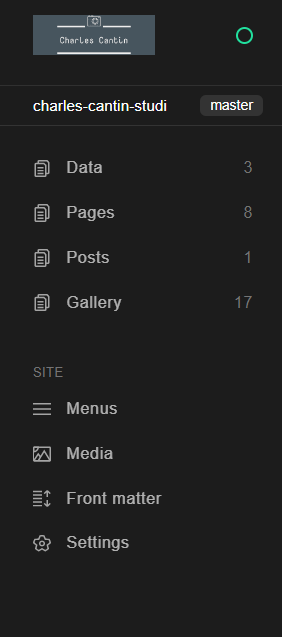

# Charles Cantin Photographe

## Projet pour l'Evaluation Continue de Formation Studi : développement de la partie Frontend d'une application web

### Installation
- Installer Node.js
- Installer Ruby : https://rubyinstaller.org/downloads/ (Windows)
- Via une ligne de commande, installer `bundler` et `jekyll` : `gem install bundler jekyll`
- Installer Visual Studio Code

### Exécution
Cloner le projet puis ouvrir le dossier du repo dans Visual Studio Code. Ouvrir un terminal de commandes, puis taper `bundle exec jekyll serve`.
Ceci va compiler puis exécuter en local le projet sur *localhost:4000*.

### Déploiement
Le déploiement se fait automatiquement via Pull Request d'une branche de développement choisie vers la branche `master`.
Après acceptation de la PR, une build est automatiquement effectuée par Trigger sur le fournisseur/hébergeur Netlify.
La partie administration du site (forestry.io) est aussi mise à jour.

### Administration
L'administration du site se fait sur forestry.io :

Un compte *Editeur* a été crée à cette occasion.